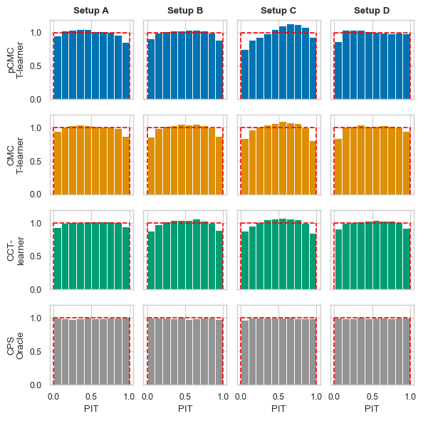

# CCT and CMC-learners

> The conformal convolution T-learner (CCT-learner) and conformal Monte Carlo (CMC) meta-learners leverage weighted conformal predictive systems (WCPS), Monte Carlo sampling, and CATE meta-learners to generate predictive distributions of individual treatment effect (ITE) that could enhance individualized decision-making. The preprint version of our paper is accessible for review and feedback. To access the preprint, please visit [here](https://arxiv.org/abs/2402.04906).

## Usage 🛠
The following code shows how the CCT and CMC learners can be used. The example uses a CCT- and CMC T-learner trained using Random Forest Regressors from sklearn, however, a X- or S-learner is also supported using `CMC_X_Learner` and `CMC_S_Learner`.

```py
from src.cmc_metalearners.cmc_metalearners import CCT_Learner, CMC_T_Learner
from sklearn.ensemble import RandomForestRegressor


X, y, W, ps = ...  # your treatment effect dataset (X = covariates, y = outcome, T = treatment variable)

# If you use the CCT version
cct_Learner = CCT_Learner(
            RandomForestRegressor(),
            RandomForestRegressor(),
            normalized_conformal=normalized_conformal,
)

#If you use the pseudo CMC version
CMC_Learner = CMC_T_Learner(
            RandomForestRegressor(),
            RandomForestRegressor(),
            normalized_conformal=normalized_conformal,
            pseudo_MC=True,
            MC_samples=MC_samples,
)

#If you use the full Monte Carlo version
CMC_Learner = CMC_T_Learner(
            RandomForestRegressor(),
            RandomForestRegressorRandomForestRegressor(),
            normalized_conformal=normalized_conformal,
            pseudo_MC=False,
            MC_samples=MC_samples,
)


cct_Learner.fit(X, y, W, ps)  # Fit the CCT-Learner on the treatment effect dataset
CMC_Learner.fit(X, y, W, ps)  # Fit the CMC-Learner on the treatment effect dataset

#Get a symmetric interval (i.e. the same amount of coverage in the right and left parts of the interval) of the CATE estimate with coverage of 1-alpha for all samples in X
int_CCT_Learner = cct_Learner.predict_int(X, confidence=1-alpha, p=ps)
int_CMC_Learner = CMC_Learner.predict_int(X, confidence=1-alpha)

#Get the predictive distribution of the CATE estimate
cps_CCT_Learner = cct_Learner.predict_cps(X, p=ps)
cps_CMC_Learner = CMC_Learner.predict_cps(X)
```

## Benchmarks ⏱

### Results on ACIC2016


### Results on synthetic data

#### Results on synthetic data (settings from Alaa et al., 2023)


##### Problistic calibration of ITE predictive distributions


#### Results on synthetic data (settings from Nie and Wager, 2021)


##### Problistic calibration of ITE predictive distributions



## How does it work ⁉️
The CCT framework is built using weighted conformal predictive systems and meta-learners. First, it fits on the outcomes and calibrates the separate learners afterwards using a weighted conformal predictive system. Using the calibrated learners, it calculates the ITE for every training sample using by performing a convolution of the potential outcomes.

The CMC framework is built using Monte Carlo sampling, weighted conformal predictive systems, and meta-learners. First, it fits the meta-learner and calibrates the separate learners afterwards using a conformal predictive system. Using the calibrated learners, n ITE Monte Carlo samples are calculated for every training sample using:
* $MC_{ITE} = \hat{Y}^1 - \hat{Y}^0 $
* $Pseudo-MC_{ITE} = W(Y-\hat{Y}^0) + (1-W)\hat{Y}^1  $

The full meta-learner is then calibrated again using conformal predictive systems on these sampled ITEs to provide a predictive distribution of the CATE, given X.

## Referencing our code :memo:

If you use *CCT-Learner* and *CMC-Learner* in a scientific publication, we would highly appreciate citing us as:

```bibtex
@misc{jonkers2025conformal,
      title={Conformal Convolution and Monte Carlo Meta-learners for Predictive Inference of Individual Treatment Effects},
      author={Jef Jonkers and Jarne Verhaeghe and Glenn Van Wallendael and Luc Duchateau and Sofie Van Hoecke},
      year={2025},
      eprint={2402.04906},
      archivePrefix={arXiv},
      primaryClass={cs.LG}
}
```
The preprint version of the paper can be found at [https://arxiv.org/abs/2402.04906](https://arxiv.org/abs/2402.04906).

## License
This package is available under the MIT license. More information can be found [here](https://github.com/predict-idlab/cmc-learner/blob/main/LICENSE).

---

<p align="center">
👤 <i>Jef Jonkers, Jarne Verhaeghe</i>
</p>

